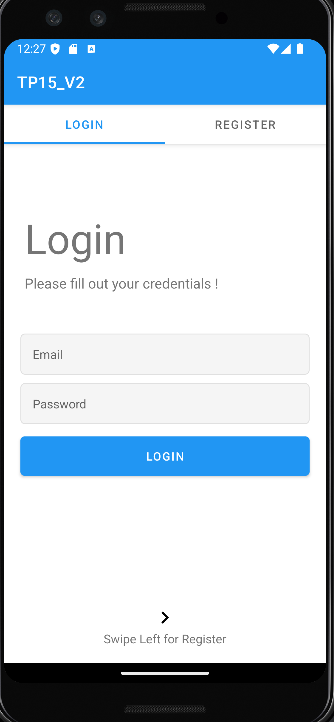
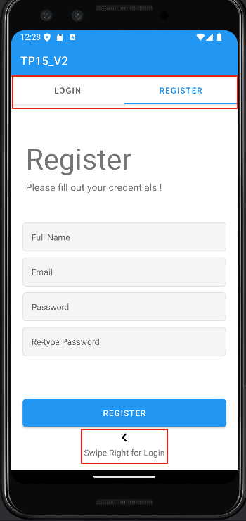

# Android Authentication App
Une application Android permettant aux utilisateurs de se connecter ou de créer un compte via une interface moderne utilisant ViewPager2 et TabLayout, construite selon l'architecture MVVM avec persistance des données via Room Database.

## 🎯 Objectifs
- Mettre en place une architecture MVVM
- Créer l'interface utilisateur en utilisant ViewPager2 et TabLayout
- Configurer l'adaptateur ViewPagerAdapter pour gérer les fragments
- Assurer l'intégration de TabLayout avec ViewPager2
- Gérer la logique métier à l'aide de UserViewModel
- Implémenter la persistance des données avec Room Database

## 📱 Fonctionnalités
### Formulaire de connexion (Login)
- Permet aux utilisateurs existants de se connecter
- Champs requis :
  - Adresse e-mail
  - Mot de passe
- Vérification des credentials dans la base de données locale

### Formulaire d'inscription (SignUp)
- Permet aux nouveaux utilisateurs de créer un compte
- Champs requis :
  - Adresse e-mail
  - Nom complet
  - Mot de passe
- Stockage sécurisé des informations utilisateur dans Room Database

### Navigation
- Navigation fluide entre les formulaires grâce à TabLayout
- Interface intuitive avec ViewPager2
- Transition transparente entre les sections Login et SignUp

## 🛠 Technologies Utilisées
- Architecture MVVM
- ViewPager2
- TabLayout
- Fragments
- ViewModel
- Data Binding
- Room Database pour la persistance des données
- Coroutines pour les opérations asynchrones de base de données

## 📸 Aperçu
<table>
  <tr>
    <td>Page de Connexion</td>
    <td>Page d'Inscription</td>
  </tr>
  <tr>
    <td></td>
    <td></td>
  </tr>
</table>

## 📦 Structure du Projet
```
app/
├── src/
│   ├── main/
│   │   ├── java/
│   │   │   ├── view/
│   │   │   │   ├── fragments/
│   │   │   │   │   ├── LoginFragment
│   │   │   │   │   └── SignUpFragment
│   │   │   │   └── adapters/
│   │   │   │       └── ViewPagerAdapter
│   │   │   ├── viewmodel/
│   │   │   │   └── UserViewModel
│   │   │   ├── model/
│   │   │   │   └── User
│   │   │   └── data/
│   │   │       ├── UserDatabase
│   │   │       ├── UserDao
│   │   │       └── UserRepository
│   │   └── res/
│   │       └── layout/
```

## 💾 Configuration de Room Database
L'application utilise Room Database pour :
- Stocker les informations des utilisateurs de manière sécurisée
- Gérer l'authentification locale
- Maintenir la persistance des données utilisateur

## 🚀 Installation
1. Clonez ce dépôt
```bash
git clone https://github.com/votre-username/android-auth-app.git
```
2. Ouvrez le projet dans Android Studio
3. Synchronisez le projet avec Gradle
4. Exécutez l'application sur un émulateur ou un appareil physique
