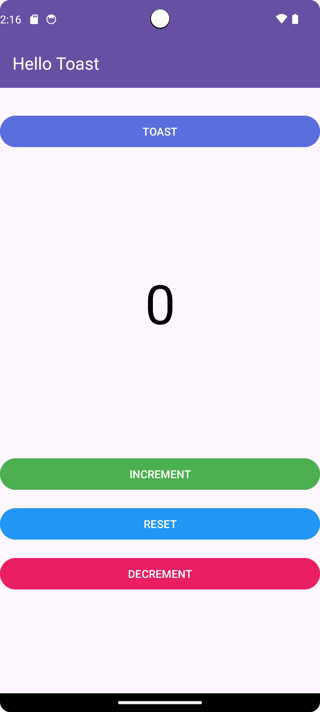
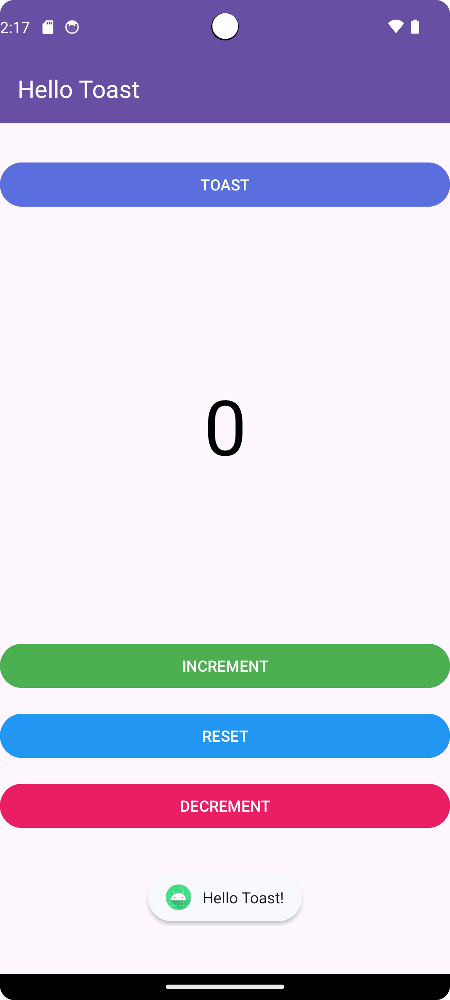
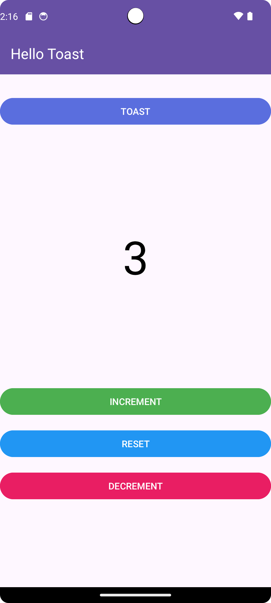
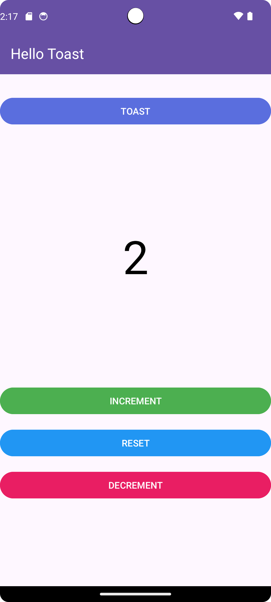

# Exercice 1 - HelloToast Application

## Objectif
L’objectif de cet exercice est de créer une application Android nommée **HelloToast**. Cette application comprend deux boutons (`Button`) et un champ texte (`TextView`).

- **Bouton Toast** : Affiche un message court (`Toast`) à l'écran lorsque l'utilisateur appuie dessus.
- **Bouton Compteur** : À chaque clic, le compteur s'incrémente et la valeur actuelle est affichée dans le `TextView`.

## Améliorations

Pour enrichir l'application, j'ai ajouté deux fonctionnalités supplémentaires :

1. **Un bouton de décrémentation** : Ce bouton permet de diminuer la valeur du compteur. Chaque clic sur ce bouton décrémente la valeur affichée dans le champ `TextView`.
2. **Un bouton de réinitialisation** : Ce bouton permet de réinitialiser le compteur à sa valeur initiale (zéro).

Ainsi, l'application offre désormais la possibilité non seulement d'incrémenter le compteur, mais aussi de le décrémenter et de le réinitialiser à tout moment.

## Captures d'écran

Voici quelques captures d'écran de l'application en action :

| Écran initial | Toast affiché | Incrémentation |
| ------------- | ------------- | -------------- |
|  |  |  |

| Décrémentation | Réinitialisation |
| -------------- | ---------------- |
|  |  |

[Voir la vidéo][tp1-exo1.webm](https://github.com/user-attachments/assets/f5913cf7-5661-4be2-abe7-bbc6e76f5dc1)
                   
  

