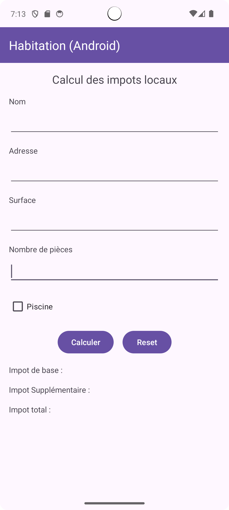
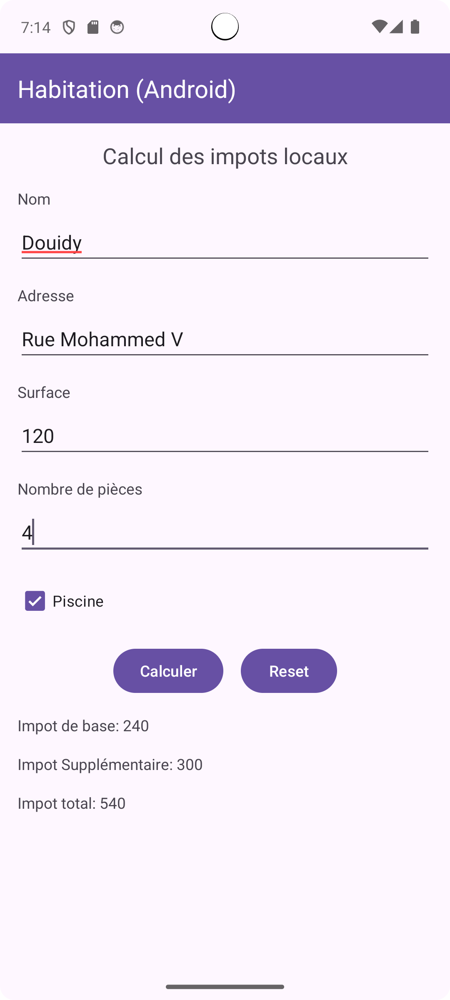

# Exercice 2 - Calcul des Impôts Locaux

## Objectif
L’objectif de cet exercice est de créer une application mobile qui permet de calculer le prix des impôts locaux de voiture.

### Améliorations
Pour enrichir l'application, j'ai ajouté un bouton supplémentaire :
- **Un bouton de réinitialisation** : Ce bouton permet de réinitialiser le formulaire à sa valeur initiale (les `EditText` vides).

### Captures d'écran
Voici quelques captures d'écran de l'application en action :

| Écran initial | Affichage des différents montants |
| ------------- | ---------------------------------- |
|  |  |

 
 

Ceci est une courte vidéo montrant l'application **Calcul des Impôts Locaux** en action :

[Voir la vidéo](https://github.com/user-attachments/assets/7e208f67-7fc6-48fe-a8b3-9deddc9d4ec7)

