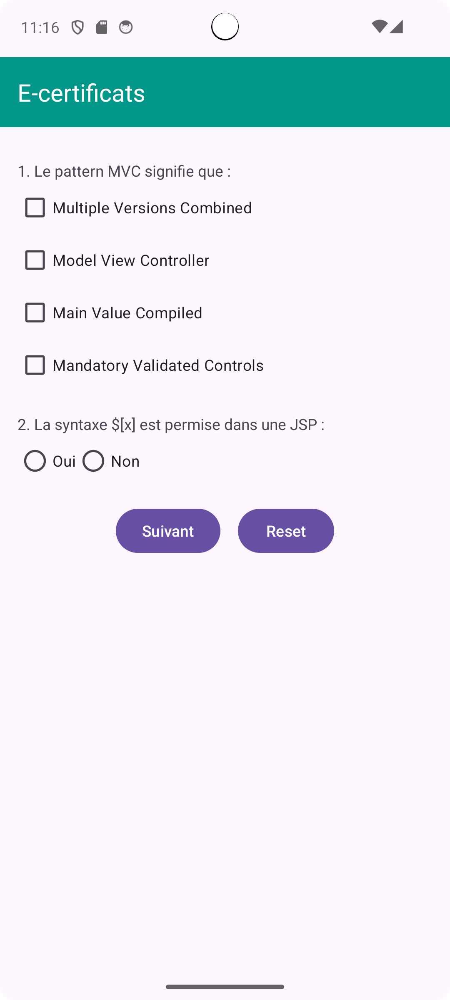
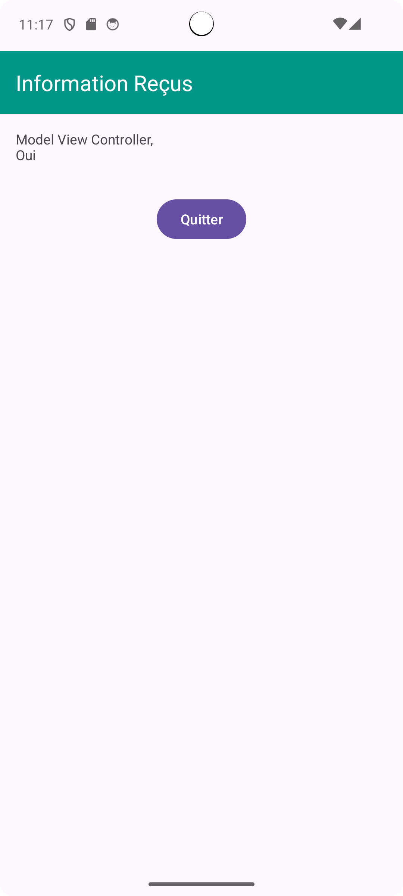

# Exercice 3 - Affichage du Contenu Sélectionné

## Objectif
L’objectif de cet exercice est d’afficher le contenu sélectionné dans une autre activité en cliquant sur le bouton **« Suivant »**.

### Améliorations
Pour enrichir l'application, j'ai ajouté deux boutons supplémentaires :
1. **Un bouton de réinitialisation** : Ce bouton permet de réinitialiser les **CheckBox** et les **RadioButton** dans le **RadioGroup** à sa valeur initiale (les `EditText` vides).
2. **Un bouton de retour** : Ce bouton permet de retourner à l'activité précédente.

### Captures d'écran
Voici quelques captures d'écran de l'application en action :

| Écran initial | Affichage des choix |
| ------------- | ------------------- |
|  |  |

 
 

Ceci est une courte vidéo montrant l'application **Affichage du Contenu Sélectionné** en action :

[Voir la vidéo](https://github.com/user-attachments/assets/2333dc1d-f972-45a2-a1a4-5b6b34a836e5)                                        
  
  
                    
                      
  

