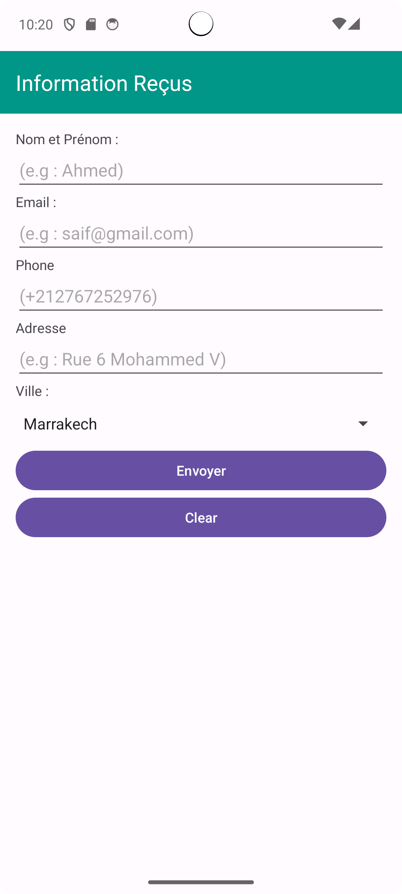
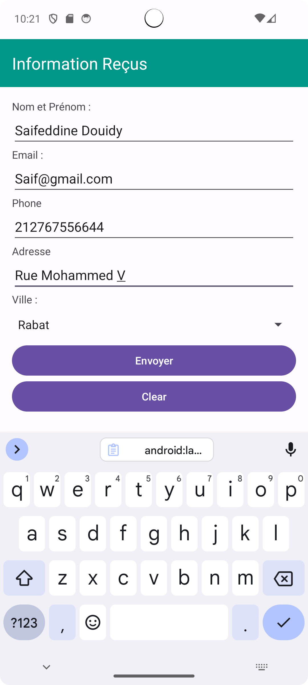
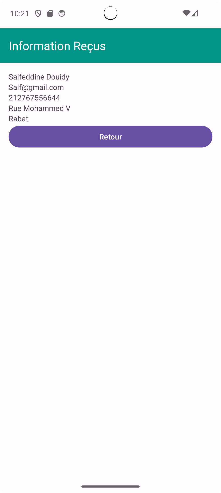

# Travail à Rendre - Affichage du Contenu Saisi dans une différente activité

## Objectif
L’objectif de cet exercice est d’afficher le contenu saisi par un utilisateur dans une autre activité en cliquant sur le bouton **« Envoyer »**.

### Améliorations
Pour enrichir l'application, j'ai ajouté deux boutons supplémentaires :
1. **Un bouton de réinitialisation** : Ce bouton permet de réinitialiser les **EditText** et les **CheckBox**.
2. **Un bouton de retour** : Ce bouton permet de retourner à l'activité précédente.

### Captures d'écran
Voici quelques captures d'écran de l'application en action :

| Écran initial | Remplissage des informations | Affichage dans une autre activité |
| ------------- | --------------------------- | --------------------------------- |
|  |  |  |

 
 

Ceci est une courte vidéo montrant l'application **Affichage du Contenu Saisi** en action :

[Voir la vidéo](https://github.com/user-attachments/assets/b03104f6-b7df-4304-9b47-f46b50f47e73)                    
  

