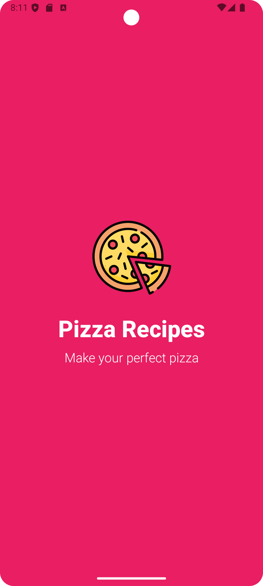
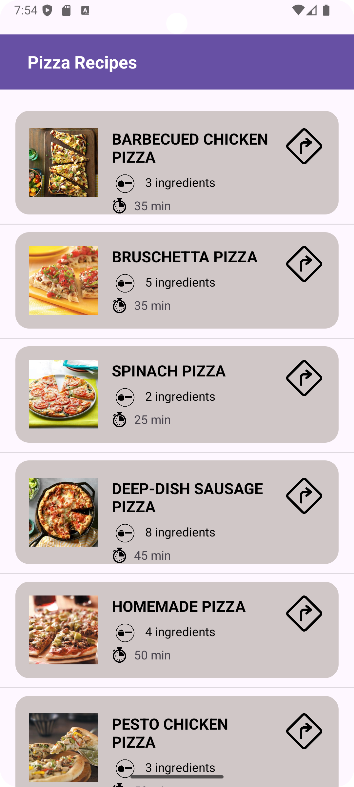
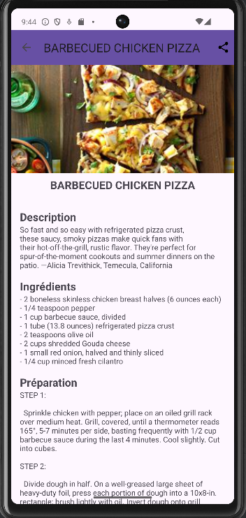

# Exercice - Application de Recettes de Pizza

## Objectif
L’objectif de cet exercice est de créer une application Android nommée **Recettes de Pizza**. Cette application permet aux utilisateurs de consulter diverses recettes de pizza avec des instructions détaillées et la liste des ingrédients.

- **ListView de Recettes** : Affiche une liste de recettes de pizza avec une image, le nom de la pizza, et un aperçu des ingrédients.
- **Détails de la Recette** : Lorsqu'un utilisateur clique sur une pizza, il est redirigé vers une nouvelle activité affichant la description complète, les ingrédients et les étapes de préparation.

## Améliorations

Pour enrichir l'application, j'ai ajouté deux fonctionnalités supplémentaires :

1. **Partage via WhatsApp** : Les utilisateurs peuvent partager leurs recettes de pizza préférées directement sur WhatsApp.
2. **Splash Screen animé** : Une écran de démarrage avec une animation pour rendre l'expérience utilisateur plus attrayante.

Ainsi, l'application offre une navigation fluide entre les recettes tout en permettant aux utilisateurs de partager facilement leurs recettes favorites.

## Captures d'écran

Voici quelques captures d'écran de l'application en action :

| Écran de démarrage | Liste des Recettes |
| ------------------- | ------------------ |
|  |  |

| Détails de la Recette | Partage de la Recette |
| ---------------------- | --------------------- |
|  |  |

   
 

Ceci est une courte vidéo montrant l'application **Recettes de Pizza** en action :

[Voir la vidéo](https://github.com/user-attachments/assets/e2c6a0e7-c3d0-4c76-8010-071b4b57cc03)

