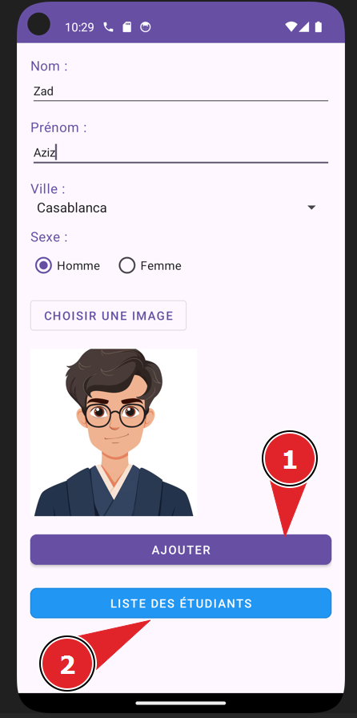
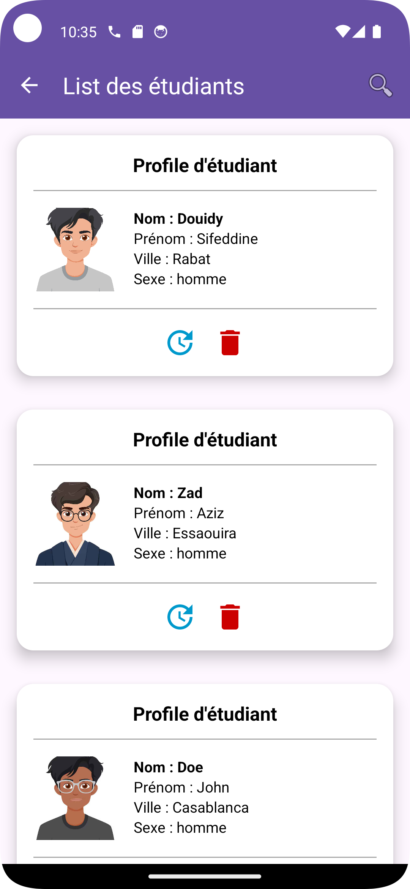
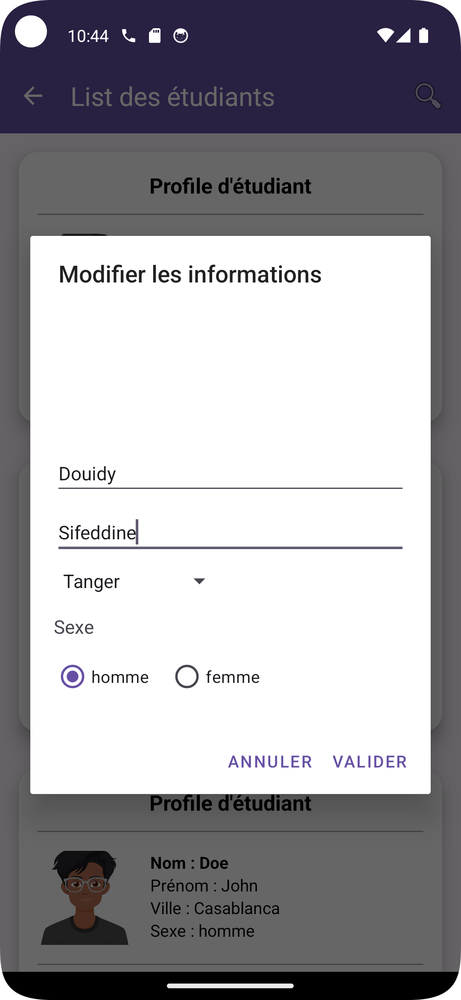
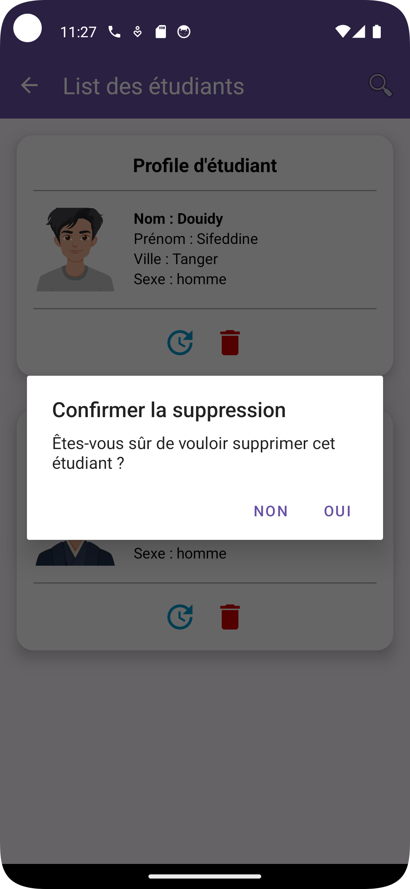
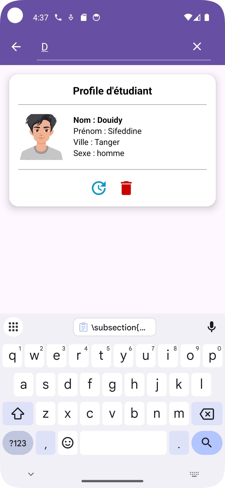

# Application Android de Gestion des Étudiants

## Objectif
L'objectif de ce projet est de créer une application Android nommée **Gestion des Étudiants**. Cette application permet aux utilisateurs de gérer les informations des étudiants dans un établissement éducatif, offrant une interface intuitive pour consulter, ajouter, modifier et supprimer les données des étudiants.

## Fonctionnalités Principales
1. **Liste des Étudiants** : Affichage des étudiants dans un RecyclerView avec photo, nom et informations de base.
2. **Ajout d'Étudiant** : Possibilité d'ajouter un nouvel étudiant avec ses informations via un formulaire.
3. **Modification des Données** : Option pour mettre à jour les informations d'un étudiant existant.
4. **Suppression d'Étudiant** : Fonctionnalité pour retirer un étudiant de la base de données.
5. **Recherche d'Étudiant** : Fonctionnalité pour rechercher/filtrer un étudiant dans la base de données.

## Améliorations
Pour enrichir l'application, plusieurs fonctionnalités ont été ajoutées :
1. **Interface Utilisateur Intuitive** : Une navigation fluide entre les différentes fonctionnalités de l'application.
2. **Gestion Complète des Données** : Capacité à effectuer toutes les opérations CRUD (Create, Read, Update, Delete) sur les informations des étudiants.
3. **Recherche Avancée** : Possibilité de filtrer et trouver rapidement les informations d'un étudiant spécifique.

## Captures d'écran
Voici quelques captures d'écran de l'application en action :

| Ajout d'Étudiant | Liste des Étudiants | Modification d'Étudiant | Suppression d'Étudiant | Recherche d'Étudiant |
|:----------------:|:-------------------:|:-----------------------:|:----------------------:|:--------------------:|
|  |  |  |  |  |

