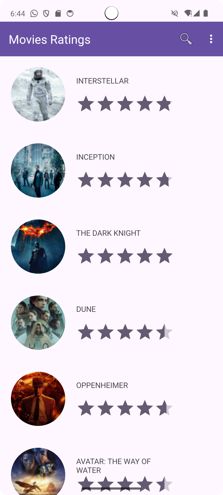
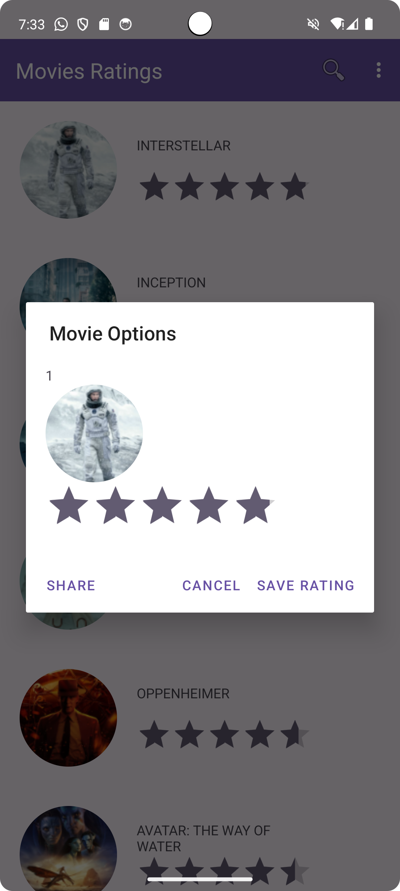

# Exercice - Application de Notation de Films

## Objectif
L’objectif de cet exercice est de créer une application Android nommée **Notation de Films**. Cette application permet aux utilisateurs de consulter divers films avec des notes, des descriptions détaillées et des affiches.

- **RecyclerView des Films** : Affiche une liste de films avec une image, le nom du film, et la note attribuée.
- **Détails du Film** : Lorsqu'un utilisateur clique sur un film, un popup s'affiche on lui donnant la possibilité de modifier la note du film, annuler l'action ou bien partager les informations sur le titre.

## Améliorations

Pour enrichir l'application, j'ai ajouté deux fonctionnalités supplémentaires :

1. **Modification de la Note** : Les utilisateurs peuvent modifier la note d'un film après l'avoir visionné.
2. **Partage** : Les utilisateurs peuvent partager leurs films préférés directement sur WhatsApp, email, sms, etc.

Ainsi, l'application offre une navigation fluide entre les films tout en permettant aux utilisateurs de partager facilement leurs films favoris.

## Captures d'écran

Voici quelques captures d'écran de l'application en action :

| Écran de démarrage | Liste des Films |
| ------------------- | --------------- |
|  |  |

| Popup pour chaque Film | Partage du Film |
| ---------------- | ---------------- |
|  |  |

   
 

Ceci est une courte vidéo montrant l'application **Notation de Films** en action :

[Voir la vidéo](https://github.com/user-attachments/assets/0e28c35f-aa13-428a-b3a1-d47f29c1ca7b)

